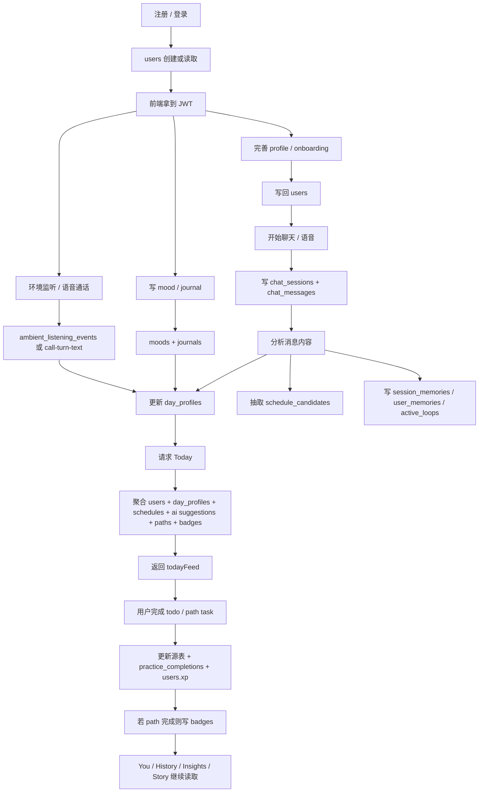
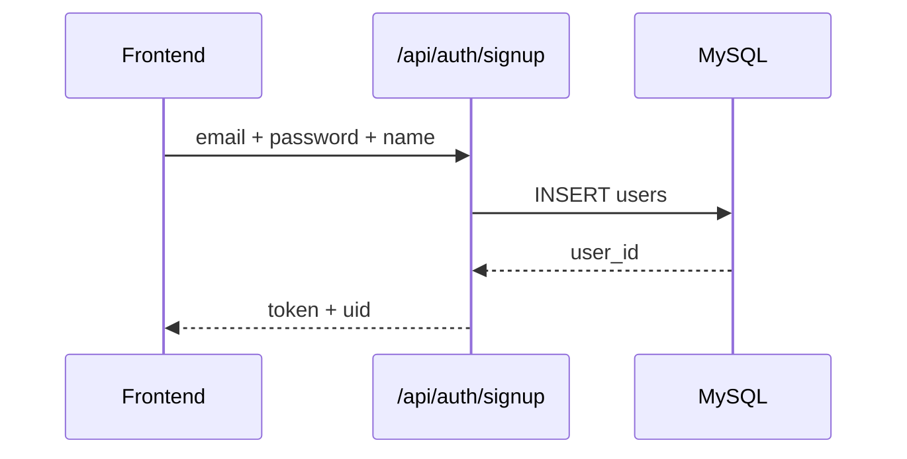
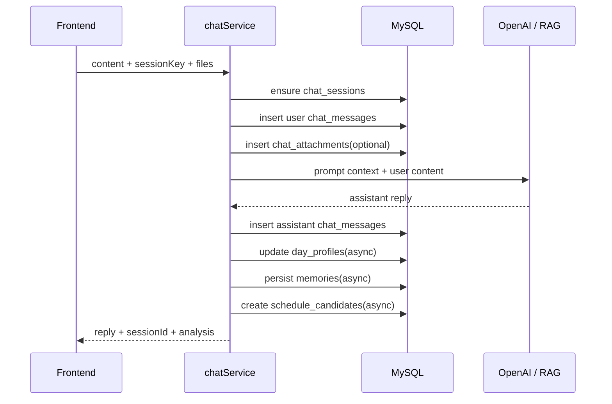
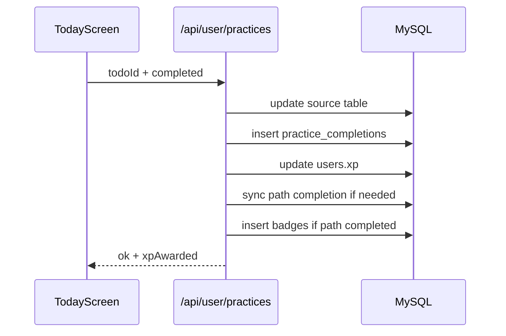
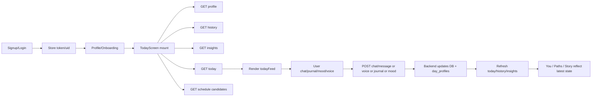

# William ER 文档与用户旅程图

这份文档只基于当前代码和当前 schema，不写理想态。

目标有两个：

1. 解释当前数据库实体之间的真实关系
2. 解释一个用户从注册开始，数据如何在前端、后端、数据库之间流转

---

## 1. 系统分层

当前项目可以拆成 6 个数据域：

- 认证与用户档案
- 聊天与上下文记忆
- 情绪、日记与日级画像
- 日程、practice、recovery path
- 语音与环境监听
- 叙事与成长结果

对应主入口：

- 认证：`backend/src/routes/auth.js`
- 用户域：`backend/src/routes/user.js`
- 聊天域：`backend/src/routes/chat.js`
- 语音域：`backend/src/routes/voice.js`
- Journey 域：`backend/src/routes/journey.js`

---

## 2. ER 总览

### 2.1 核心主实体

- `users`
  - 全系统主根实体
  - 一个用户向下挂所有行为、画像、记忆、路径、徽章

- `chat_sessions`
  - 一次聊天容器
  - 一个用户可以有多个 session

- `chat_messages`
  - 一次会话里的具体消息
  - user / assistant 都写进这里

- `day_profiles`
  - 用户按天聚合后的行为画像
  - 来自 chat、mood、journal、ambient listening、practice 等多源融合

- `user_recovery_paths`
  - 用户当前月份或 AI 审查生成的 recovery path

- `recovery_path_tasks`
  - path 被拆开的日任务

### 2.2 Mermaid ER 图

```mermaid
erDiagram
    users ||--o{ chat_sessions : owns
    users ||--o{ chat_messages : writes
    users ||--o{ moods : logs
    users ||--o{ journals : writes
    users ||--o{ day_profiles : aggregates
    users ||--o{ ambient_listening_events : records
    users ||--o{ practice_completions : completes
    users ||--o{ badges : earns
    users ||--o{ journey_enrollments : enrolls
    users ||--o{ schedule_candidates : receives
    users ||--o{ user_memories : stores
    users ||--o{ session_memories : owns
    users ||--o{ memory_events : emits
    users ||--o{ user_active_loops : carries
    users ||--o{ intervention_outcomes : produces
    users ||--o{ user_intervention_preferences : tunes
    users ||--o{ journey_reflection_entries : answers
    users ||--o{ outreach : triggers
    users ||--o{ daily_stories : receives
    users ||--o{ pattern_milestones : unlocks
    users ||--o{ user_recovery_paths : owns
    users ||--o{ daily_ai_path_reviews : reviews
    users ||--o{ recovery_path_tasks : owns
    users ||--o{ ai_practice_suggestions : receives
    users ||--o{ password_reset_tokens : requests

    chat_sessions ||--o{ chat_messages : contains
    chat_sessions ||--o{ session_memories : summarized_into
    chat_sessions ||--o{ memory_events : emits
    chat_sessions ||--o{ schedule_candidates : source_session

    chat_messages ||--o{ chat_attachments : has
    chat_messages ||--o{ schedule_candidates : extracts_to

    journey_reflection_entries ||--o{ journey_reflection_answers : contains
    user_recovery_paths ||--o{ recovery_path_tasks : splits_into

    recovery_path_templates ||--o{ user_recovery_paths : instantiates
```

### 2.3 关系说明

#### 用户主线

- `users` 是唯一主键根
- 几乎所有业务表都通过 `user_id` 挂到用户

#### 聊天主线

- `chat_sessions` 1:N `chat_messages`
- `chat_messages` 1:N `chat_attachments`
- `chat_messages` 1:N `schedule_candidates`（按 source message 抽取）

#### 状态画像主线

- `moods`、`journals`、`chat_messages`、`ambient_listening_events` 不直接彼此关联
- 它们共同向 `day_profiles` 聚合
- `day_profiles` 是 Today / You / Insights 的主要读取底座

#### 恢复路径主线

- `recovery_path_templates` 是模板
- `user_recovery_paths` 是用户实例
- `recovery_path_tasks` 是用户实例下的日任务
- `daily_ai_path_reviews` 记录“每日 AI 审查”和 Today banner 来源

#### 成长结果主线

- `practice_completions` 记录任务完成事实
- `badges` 记录 path 完成后的徽章结果
- `pattern_milestones` / `daily_stories` / `journey_reflection_entries` 属于结果与叙事层

---

## 3. 表分组说明

### 3.1 认证与用户档案

| 表 | 作用 | 关键字段 |
| --- | --- | --- |
| `users` | 用户主档案 | `email`, `password`, `name`, `language`, `voice_mode`, `challenges`, `xp`, `streak`, `onboarded` |
| `password_reset_tokens` | 找回密码临时令牌 | `email`, `token`, `expires_at`, `used` |

### 3.2 聊天与记忆

| 表 | 作用 | 关键字段 |
| --- | --- | --- |
| `chat_sessions` | 会话容器 | `user_id`, `session_key`, `is_temporary` |
| `chat_messages` | 用户和 AI 消息 | `session_id`, `user_id`, `role`, `content`, `analysis`, `voice_id` |
| `chat_attachments` | 附件抽取结果 | `message_id`, `session_id`, `kind`, `summary`, `ocr_text` |
| `session_memories` | 当前 session 摘要 | `session_id`, `scope`, `summary`, `key_topics` |
| `user_memories` | 长期记忆 | `user_id`, `scope`, `memory_type`, `content`, `canonical_key` |
| `memory_events` | 记忆调试轨迹 | `session_id`, `message_id`, `event_type`, `payload` |
| `user_active_loops` | 进行中事项 | `user_id`, `active_loop_type`, `summary`, `status` |
| `intervention_outcomes` | 干预效果记录 | `user_message_id`, `assistant_message_id`, `intervention_type`, `outcome_status` |
| `user_intervention_preferences` | 干预偏好 | `user_id`, `intervention_type`, `effectiveness_score` |

### 3.3 情绪、日记、画像

| 表 | 作用 | 关键字段 |
| --- | --- | --- |
| `moods` | 快速情绪打卡 | `mood`, `stress`, `note`, `note_analysis` |
| `journals` | 日记正文与分析 | `entry_date`, `text_content`, `analysis`, `deep_analysis` |
| `day_profiles` | 日级聚合画像 | `chat_*`, `mood_*`, `stress_*`, `journal_*`, `ambient_*`, `practice_count` |
| `ambient_listening_events` | 环境监听事件 | `transcript`, `analysis_json`, `source_page` |

### 3.4 日程、practice、path

| 表 | 作用 | 关键字段 |
| --- | --- | --- |
| `schedule_candidates` | 从聊天抽取的待确认日程 | `source_message_id`, `title`, `start_time`, `status`, `todo_status` |
| `practice_completions` | practice 完成事实表 | `practice_id`, `source_type`, `source_ref_id`, `xp_awarded` |
| `recovery_path_templates` | path 模板 | `title`, `summary`, `default_tasks`, `badge_id` |
| `user_recovery_paths` | 用户 path 实例 | `template_id`, `month_start`, `generation_source`, `status`, `badge_id` |
| `recovery_path_tasks` | path 拆分任务 | `user_path_id`, `task_date`, `task_kind`, `status` |
| `ai_practice_suggestions` | AI 插入的当日建议 | `suggestion_date`, `title`, `trigger_label`, `status` |
| `daily_ai_path_reviews` | 每日 AI path 审查记录 | `review_date`, `status`, `banner_title`, `related_path_id` |
| `journey_enrollments` | 老 journey 进度 | `journey_id`, `current_step` |
| `journey_paths` | 老静态 path 定义 | `title`, `steps`, `gradient` |
| `practices` | 老 practice 静态定义 | `slot`, `icon`, `name`, `description` |

### 3.5 结果与叙事

| 表 | 作用 | 关键字段 |
| --- | --- | --- |
| `badges` | 已获得徽章 | `badge_id`, `earned_at` |
| `daily_stories` | 日故事卡 | `date_key`, `panels` |
| `pattern_milestones` | 模式里程碑 | `milestone_type`, `title`, `evidence_json` |
| `journey_reflection_entries` | 周期反思容器 | `start_date`, `end_date`, `status` |
| `journey_reflection_answers` | 反思题答案 | `entry_id`, `question_index`, `answer_text` |
| `outreach` | 主动关怀记录 | `reasons`, `urgency`, `message` |

---

## 4. 用户旅程图

下面这条链路描述的是“一个普通注册用户”从进入系统到形成长期使用痕迹的真实数据流。

### 4.1 总体旅程图

---

## 5. 注册开始的逐步数据流

## 5.1 注册 / 登录

入口：

- `POST /api/auth/signup`
- `POST /api/auth/login`
- `POST /api/auth/guest`

实现：

- `backend/src/routes/auth.js`

### 写入

- 注册：`INSERT INTO users`
- 登录：读取 `users`，验证密码，更新 `users.last_active`
- 游客：创建一条 guest user

### 返回给前端

- `token`
- `uid`
- 登录时还返回 `name`、`onboarded`

### 数据流意义

- 从这一刻开始，前端用 JWT 持续访问 `/api/user/*`、`/api/chat/*`、`/api/voice/*`
- `users.id` 成为后续所有业务数据的统一外键

### Sequence 图

## 5.2 Profile / Onboarding

入口：

- `GET /api/user/profile`
- `POST /api/user/profile`

实现：

- `backend/src/services/userProfileService.js`

### 读取

- 直接读 `users`

### 写入

- 更新 `name / age / bio / challenges / sleep / work / voice_mode / language / perms / onboarded`

### 数据流意义

- `users` 里的显式偏好会直接进入后续 prompt context
- `language` 决定前端语言和语音相关行为
- `challenges` 会影响 path 推断和 today feed

## 5.3 聊天

入口：

- `POST /api/chat/message`
- 语音通话实际上也会复用聊天主线：`POST /api/voice/call-turn-text`

实现主链：

- `backend/src/services/chatService.js`

### 写入顺序

1. `chat_sessions`
   - 如果 session 不存在就创建
2. `chat_messages`
   - 先写 user message
3. `chat_attachments`
   - 如果有文件或 URL 导入
4. `chat_messages`
   - 回填附件分析后的 `content / attachments / analysis`
5. 组装 prompt context
6. 调模型拿 reply
7. `chat_messages`
   - 再写 assistant message
8. 后台异步更新：
   - `day_profiles`
   - `session_memories`
   - `user_memories`
   - `memory_events`
   - `user_active_loops`
   - `intervention_outcomes`
   - `schedule_candidates`

### 为什么聊天是核心数据入口

因为它同时驱动四条线：

- 对话历史
- 当日画像
- 记忆系统
- 日程候选 / recovery signal

### Sequence 图

## 5.4 Mood 与 Journal

入口：

- `POST /api/user/mood`
- `POST /api/user/journal`

实现：

- `backend/src/services/userWellbeingService.js`

### Mood 写入

- `moods`
- 同时 upsert `day_profiles`
  - 写 `mood_avg / stress_avg / stress_peak / composite_stress`

### Journal 写入

- `journals`
- 同时 upsert `day_profiles`
  - 写 `journal_topics / journal_patterns / mood_avg / stress_avg / composite_mood / composite_stress`

### 数据流意义

- `moods` 和 `journals` 是原始事实
- `day_profiles` 是真正被 Today / Insights / You 大量消费的聚合层

## 5.5 语音与环境监听

入口：

- `POST /api/voice/transcribe`
- `POST /api/voice/transcribe-chunk`
- `POST /api/voice/call-turn-text`
- `POST /api/voice/ambient-listening`
- `POST /api/voice/ambient-listening-audio`

### 两条不同链路

#### 语音通话

- `call-turn-text` 最终直接调用 `processChatTurn`
- 所以它和普通聊天最终写入同一套 `chat_sessions / chat_messages / day_profiles / memory / schedule_candidates`

#### 环境监听

- 写 `ambient_listening_events`
- 同时聚合更新 `day_profiles.ambient_*`

### 数据流意义

- 语音通话是“聊天入口的一种形式”
- 环境监听不是聊天历史，而是额外的日级信号源

## 5.6 Today 数据包

入口：

- `GET /api/user/today`

实现：

- `backend/src/services/userWellbeingService.js`

### Today feed 读取的核心表

- `users`
- `day_profiles`
- `ai_practice_suggestions`
- `schedule_candidates`
- `user_recovery_paths`
- `recovery_path_tasks`
- `badges`
- `journey_enrollments`
- `daily_ai_path_reviews`

### Today feed 还会触发的自动生成逻辑

1. `ensureCurrentMonthPaths`
   - 如果这个月还没有 monthly planner path，则创建
2. `ensureDailyAiPathReview`
   - 做每日 AI 审查
   - 必要时生成新的 review path
   - 必要时生成 Today banner
3. `ensureTodayAiSuggestion`
   - 如果今天还没有 AI suggestion，则生成一条

### 返回到前端的关键聚合字段

- `focusChallenge`
- `insight`
- `practiceTodos`
- `monthlyPaths`
- `badges`
- `pathReviewBanner`

### 数据流意义

- `Today` 不是直接读单表
- 它是整个用户状态的“聚合视图”

## 5.7 用户完成 Today todo

入口：

- `POST /api/user/practices`

### 根据 todo 来源分三种更新

#### 1. 手动日程类

- 更新 `schedule_candidates.todo_status`

#### 2. AI suggestion 类

- 更新 `ai_practice_suggestions.status`

#### 3. path task 类

- 更新 `recovery_path_tasks.status`
- 然后重新检查所属 `user_recovery_paths` 是否已全部完成

### 无论哪种来源都会追加

- `practice_completions`
- `users.xp += xpAwarded`

### 如果 path 完成

- 更新 `user_recovery_paths.status = completed`
- 插入 `badges`

### Sequence 图

## 5.8 You / History / Insights / Story

### You 页面

主要读：

- `day_profiles`
- `badges`
- `pattern_milestones`
- `journey_reflection_entries`
- `journey_enrollments`

### History / Insights

主要读：

- `day_profiles`
- `engine.analyzeLongitudinal(...)`

### Story

主要读：

- `daily_stories`
- 或由 `storyGeneratorService` 基于 `day_profiles / journals / schedule_candidates / practice_completions` 生成

---

## 6. 从前端角度看的一次完整流转

---

## 7. 当前实现里的几个关键设计点

### 7.1 `day_profiles` 是中台表

它不是原始事实表，而是聚合层。

Today、You、Insights、Story 都高度依赖它，所以：

- chat 写它
- mood 写它
- journal 写它
- ambient listening 写它
- practice 完成也会间接影响它的消费结果

### 7.2 `Today` 是聚合读模型，不是单一业务表

`/api/user/today` 会：

- 先读已有数据
- 再做必要的自动生成
- 最后再把 path、todo、badge、banner 聚合返回

也就是说，Today 既是读取口，也是部分“按需生成”的触发口。

### 7.3 聊天是很多能力的上游

聊天不仅仅产生聊天记录，还会驱动：

- `day_profiles`
- `user_memories`
- `session_memories`
- `schedule_candidates`
- `intervention_outcomes`
- path review 的后续判断信号

### 7.4 path 系统现在有两种来源

- `monthly_planner`
  - 月初/当月首次访问 Today 时生成
- `daily_ai_review`
  - 每天 AI 审查后新增

它们共用同一套：

- `user_recovery_paths`
- `recovery_path_tasks`
- `badges`

---

## 8. 代码对应关系

### 认证

- `backend/src/routes/auth.js`

### 用户档案

- `backend/src/services/userProfileService.js`

### 聊天主链

- `backend/src/services/chatService.js`
- `backend/src/services/ai.js`
- `backend/src/services/prompting/composePromptContext.js`

### 记忆主链

- `backend/src/services/memoryService.js`

### 情绪与 Today 主链

- `backend/src/services/userWellbeingService.js`

### 语音与环境监听

- `backend/src/routes/voice.js`
- `backend/src/services/ambientListeningService.js`

### 日程候选

- `backend/src/services/scheduleCandidateService.js`

---

## 9. 一句话总结

如果只记一句话，可以记这个：

> `users` 是主根，`chat/messages + mood + journal + ambient` 是原始行为事实，`day_profiles` 是日级聚合中台，`today feed` 是面向页面的聚合读模型，`paths/practice/badges` 则是从这些信号中衍生出来的干预与结果层。
